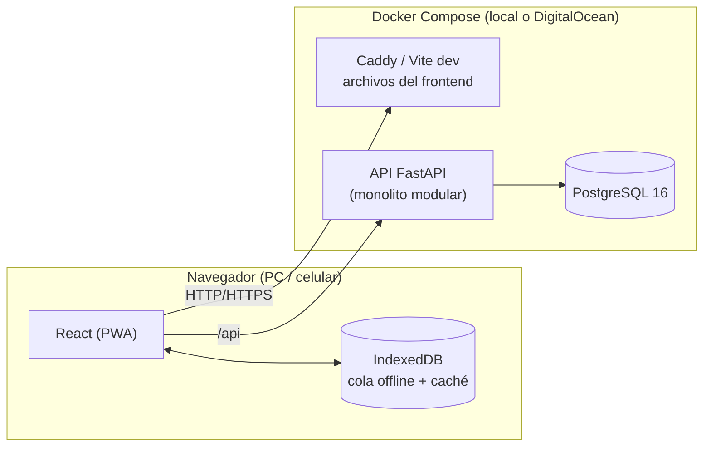
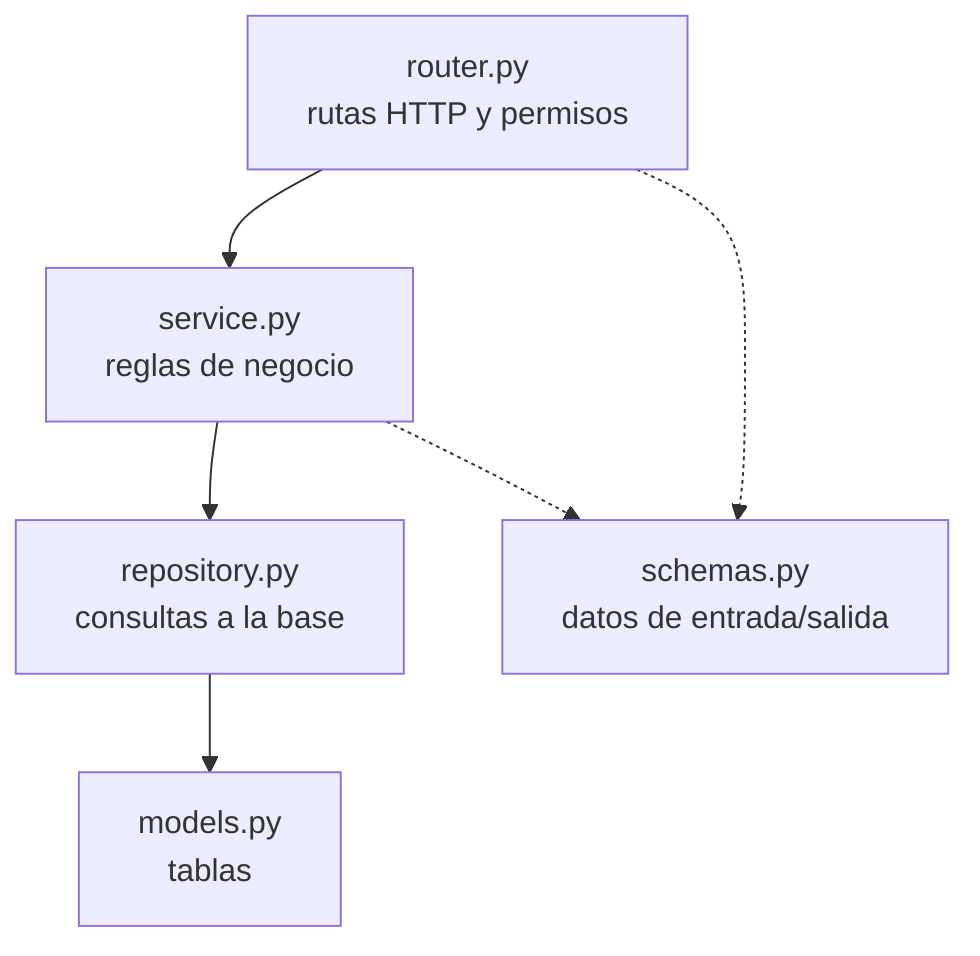
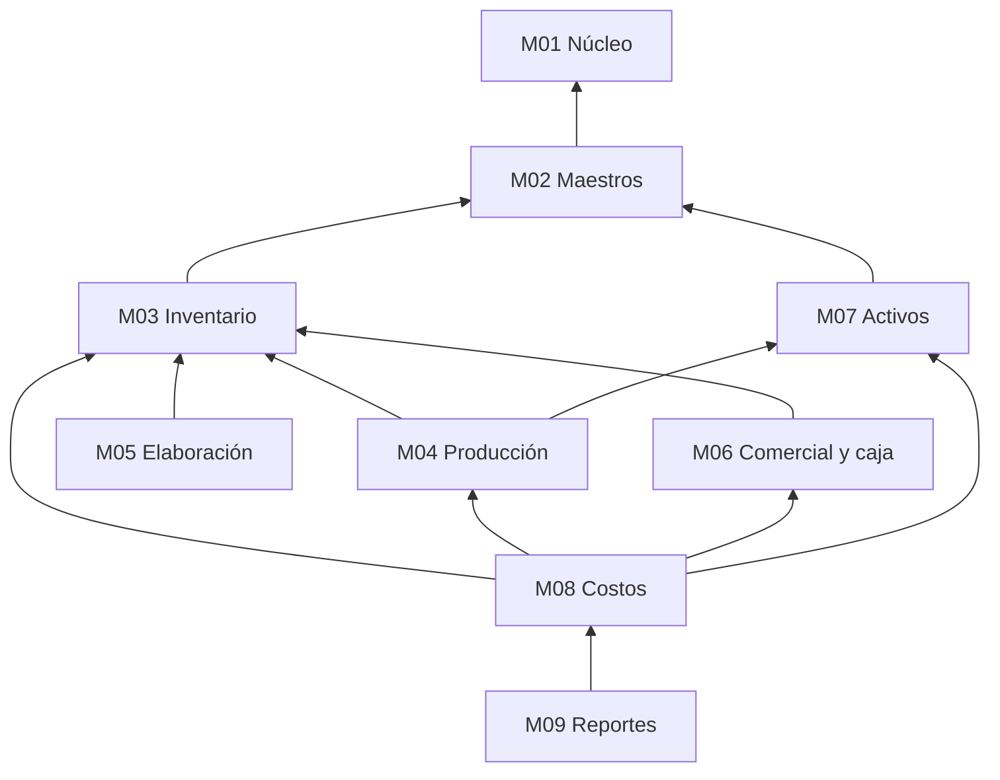

# Arquitectura general

**Monolito modular**: una sola aplicación y una sola base de datos, organizada por módulos de negocio con límites claros ([[ADR-003-Monolito-modular]]).

## Componentes

## Capas dentro de cada módulo

| Capa | Responsabilidad | No hace |
|---|---|---|
| `router` | Recibe la petición, verifica permisos, llama al service, devuelve la respuesta | Lógica de negocio |
| `service` | Reglas de negocio (stock suficiente, ciclo abierto, recálculo de costos) | SQL, HTTP |
| `repository` | Consultas y guardado | Decisiones de negocio |
| `models` / `schemas` | Tablas / formatos de entrada y salida | — |

Reglas:
1. Un módulo usa el **service** de otro módulo, nunca su repository ni sus tablas.
2. Una operación = una transacción (abierta por request). Ej.: registrar una labor descuenta stock y guarda la labor, todo o nada.
3. Lo común (auditoría, paginación, errores, permisos, base de modelos) vive en `core/` y se reutiliza — no se repite en cada módulo.

## Dependencias entre módulos

## Ejemplo: registrar una aplicación de insecticida
1. El secretario carga la labor "Aplicación" en el ciclo *Tomate – Lote 3*: 2 L de insecticida del Depósito y el Tractor 2 durante 1,5 h.
2. `production.service` verifica que el ciclo esté abierto, guarda la labor y pide a `inventory.service` el **consumo** → salida de stock valuada a costo promedio, con lote, ciclo, labor y temporada.
3. El uso del tractor queda registrado (1,5 h × costo por hora del activo).
4. El historial registra quién lo cargó y cuándo.
5. El costo del ciclo se calcula a partir de estos datos ([[ADR-005-Dimensiones-y-costos-calculados]]).
