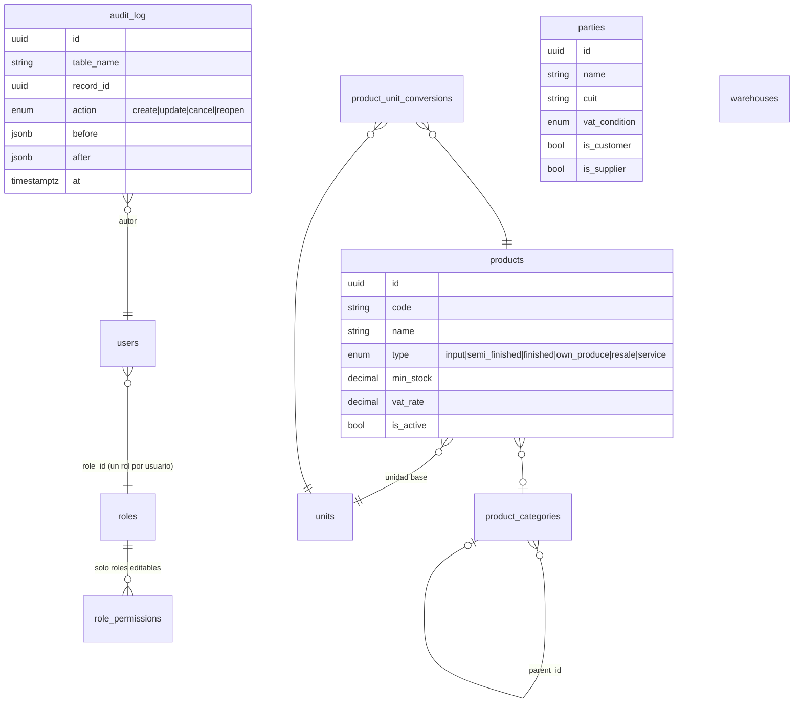
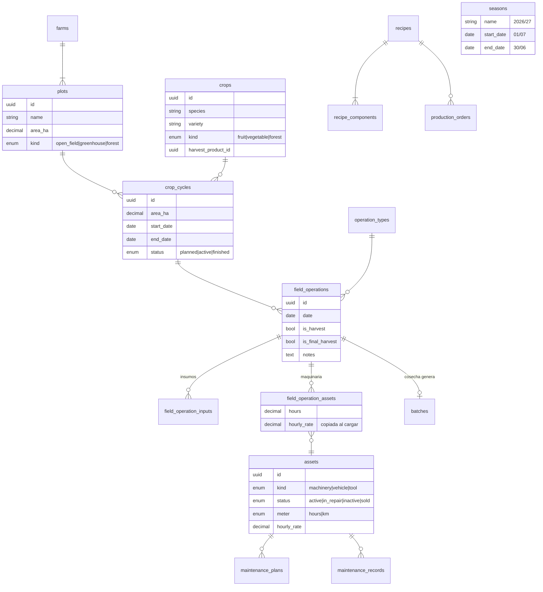
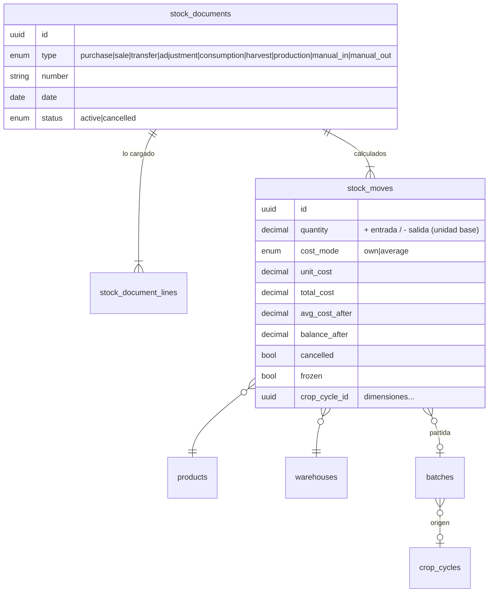
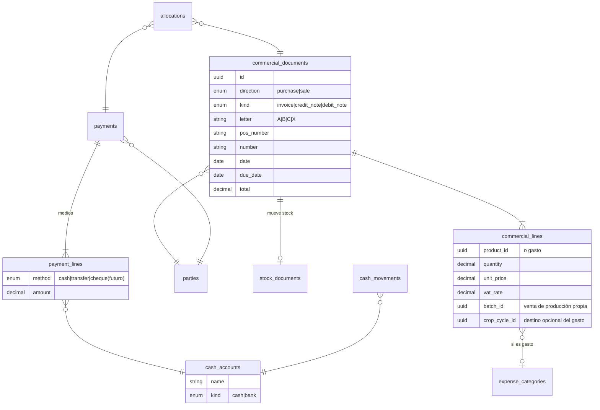

# Modelo de datos

> Vista conceptual. Cuando exista código, la **fuente de verdad del esquema son los modelos SQLAlchemy + migraciones Alembic**; esta nota se actualiza con los cambios relevantes.

## Convenciones
- PK `id UUID` (UUIDv7, generable en el cliente → carga offline).
- Tablas en inglés, plural, snake_case ([[ADR-009-Codigo-en-ingles]]).
- Toda tabla: `created_at`, `created_by`, `updated_at`, `updated_by`.
- Registros operativos: `status` con `cancelled` para anular (no se borran) ([[ADR-004-Edicion-auditoria-y-bloqueo]]).
- Montos `NUMERIC(18,2)`, cantidades `NUMERIC(18,4)`, costos unitarios `NUMERIC(18,6)`. Solo ARS.
- **Dimensiones** (columnas nullable) en todo lo que genera costo: `farm_id`, `plot_id`, `crop_cycle_id`, `field_operation_id`, `asset_id` ([[ADR-005-Dimensiones-y-costos-calculados]]).
- La **temporada no se guarda** en los movimientos: se deduce de la fecha (`seasons.start_date ≤ fecha ≤ end_date`).

## Núcleo y maestros

## Producción, elaboración y activos

## Inventario

- El stock se obtiene sumando movimientos no anulados (**sin tabla de saldos**, [[ADR-016-Motor-de-stock]]).
- **Recálculo por edición:** si se edita una compra, se recalcula el costo promedio del producto desde esa fecha y se actualiza el `unit_cost` de las salidas posteriores, **salvo las que pertenecen a ciclos finalizados** (quedan congeladas).

## Comercial y dinero

- Saldo de cuenta corriente = Σ comprobantes − Σ pagos imputados y no imputados (calculado).
- Anticipo = parte de un pago sin imputar.

## Costos
Sin tablas propias: se calculan con consultas sobre `stock_moves` (insumos consumidos), `field_operation_assets` (horas × tarifa), `commercial_lines` de gastos con destino y ventas por partida. Ver [[M08-Costos-y-Rentabilidad]].
