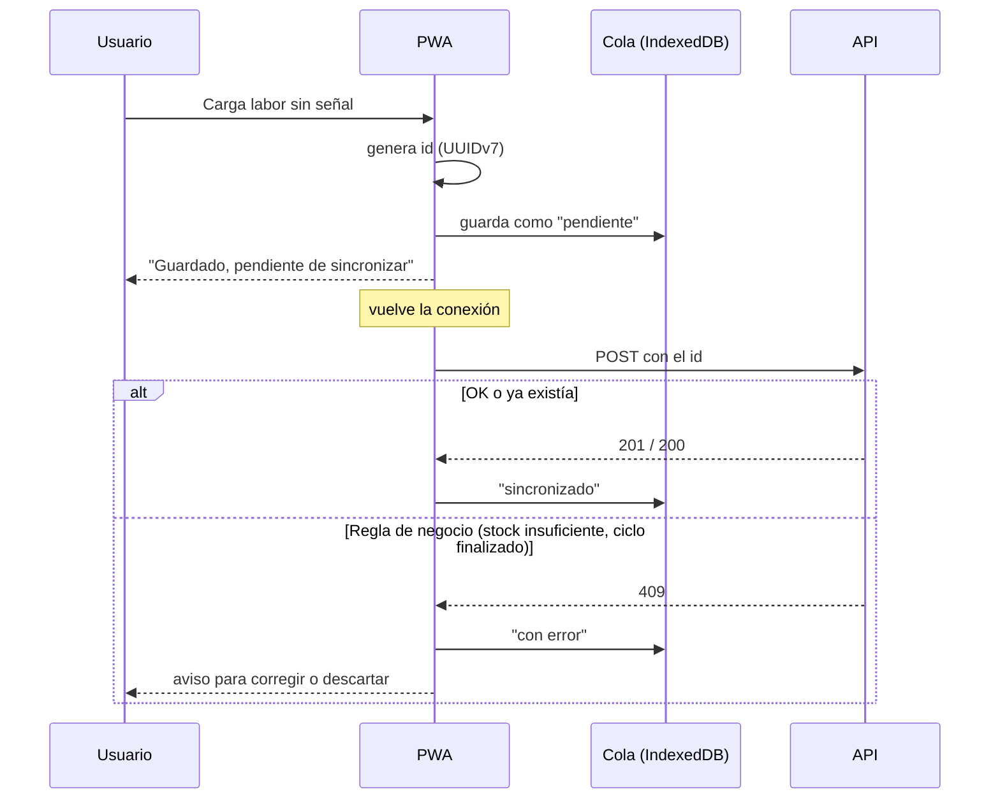

# Offline y sincronización

Decisión: [[ADR-006-Offline-limitado]]. Se habilita en F7; se prepara desde F1 (IDs generados en el cliente).

## Alcance
- **Quiénes:** dueño y secretario (tienen conexión; el offline es "por las dudas").
- **Qué se carga sin conexión:** labores (con insumos y maquinaria), cosechas, movimientos de stock simples, preparaciones de mezclas.
- **Qué requiere conexión:** comercial, caja, administración, reportes.
- **Consulta sin conexión:** maestros cacheados (productos, almacenes, lotes, ciclos activos, activos, tipos de labor) y el stock de la última sincronización (con aviso de la hora).

## Mecanismo

## Reglas
1. El `id` lo genera el cliente → reenviar no duplica.
2. El servidor revalida todo.
3. Los conflictos los resuelve el usuario (no hay resolución automática).
4. La fecha del registro es la que eligió el usuario, no la de sincronización.
5. La UI muestra si hay conexión y cuántos pendientes hay.

## Implementación (F7, 27/09/2026) ✅
**Backend:** las altas de labores/cosechas (`OperationIn`), comprobantes de stock (`DocumentIn`) y preparaciones (`OrderIn`) aceptan un `id` opcional generado en el dispositivo; si ya existe, se devuelve el registro existente sin volver a procesarlo (test `test_offline.py`).

**Frontend** (`src/app/offline/`):
- **App instalable** (`vite-plugin-pwa`): manifiesto, íconos y service worker que guarda la aplicación para abrirla sin señal (solo en la versión compilada; en desarrollo no se registra).
- **Datos guardados** (`network.ts`): el caché de consultas se persiste en IndexedDB (7 días), salvo reportes, historial, kardex, costos y tablero. `OfflineStatus` consulta al abrir la app los maestros que usan los formularios (ciclos en curso, temporadas, tipos de labor, activos, productos, unidades, almacenes, recetas) según los permisos del usuario.
- **Sesión sin señal:** si al abrir la app no hay red, se entra con el último usuario que inició sesión en ese dispositivo; al volver la señal se renueva la sesión sola.
- **Cola** (`outbox.ts`, IndexedDB): `submitOrQueue` envía o, sin red, guarda el alta con su `id`. Se sincroniza al volver la señal, al abrir la app y cada minuto; los errores de negocio quedan marcados para descartar y cargar de nuevo.
- **Indicador** en la barra superior: "Sin conexión" y "N pendientes" (con la lista, errores y "Enviar ahora").
- El buscador de productos, sin señal, busca en la lista guardada.

**Límites conocidos:** sin señal solo se dan **altas** (editar y anular requieren conexión); la lista de productos guardada es de hasta 200 productos activos.
